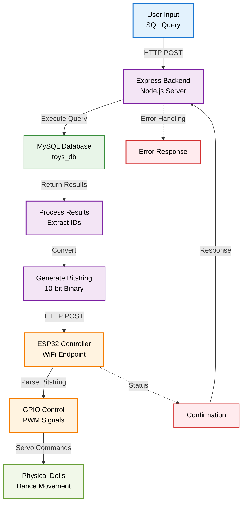

# Query2Dance

A **Database-IoT Integration System** that transforms SQL query results into physical robotic actions. When database queries match records, the system converts matching IDs into binary signals that control ESP32-connected servo motors, making corresponding dolls perform synchronized "dance" movements.

## 🏗️ System Architecture



## ⚡ How It Works

1. **Query Execution**: User submits SQL query through web interface
2. **Result Processing**: Backend executes query and extracts matching record IDs
3. **Binary Encoding**: IDs are converted to a 10-bit bitstring (e.g., `1100000000`)
4. **Hardware Communication**: Bitstring sent to ESP32 via HTTP POST
5. **Physical Action**: Each `1` bit triggers corresponding servo motor to animate a doll

## 🚀 Quick Start

### Prerequisites
- Node.js (v14+)
- MySQL Server
- Arduino IDE
- ESP32 development board
- 10 servo motors

### 1. Database Setup
```bash
# Import database schema
mysql -u root -p < database/schema.sql
```

### 2. Backend Setup
```bash
cd backend
npm install
# Update database credentials in index.js
node index.js
# Server runs on http://localhost:3000
```

### 3. ESP32 Configuration
```cpp
// Update WiFi credentials in esp/index.c
const char* ssid = "YOUR_WIFI_SSID";
const char* password = "YOUR_WIFI_PASSWORD";
```
- Open `esp/index.c` in Arduino IDE
- Install required library: `ESP8266WiFi`
- Upload to ESP32
- Note the assigned IP address for backend configuration

### 4. Frontend Access
```bash
# Simply open in web browser
open frontend/index.html
```

## 📁 Project Structure

```
Query2Dance/
├── backend/                 # Express.js API server
│   ├── index.js            # Main server file
│   └── package.json        # Node.js dependencies
├── database/               # Database schema and seed data
│   └── schema.sql          # MySQL table definitions
├── esp/                    # ESP32 firmware
│   └── index.c             # Arduino sketch
└── frontend/               # Web interface
    └── index.html          # Query input UI
```

## 🎯 Example Usage

### Sample Query
```sql
SELECT * FROM human WHERE gender='female';
```

### System Response
- **Query Results**: Records with IDs [1, 2, 3]
- **Generated Bitstring**: `1110000000`
- **Physical Action**: Dolls #1, #2, and #3 perform dance sequence

### API Endpoint
```bash
POST http://localhost:3000/query
Content-Type: application/json

{
  "query": "SELECT * FROM human WHERE age > 20",
  "API_KEY": "MY_SECRET_KEY"
}
```

## 🔧 Hardware Configuration

### Servo Connections
- **GPIO Pins**: Direct connection to ESP32 PWM pins (2, 4, 5, 12, 13, 14, 15, 16, 17, 18)
- **Servo Control**: Standard 50Hz PWM signal
- **Dance Movement**: 0° → 180° → 90° position sequence

### ESP32 Direct Wiring
```
Servo 1    ───────── GPIO 2
Servo 2    ───────── GPIO 4  
Servo 3    ───────── GPIO 5
Servo 4    ───────── GPIO 12
Servo 5    ───────── GPIO 13
Servo 6    ───────── GPIO 14
Servo 7    ───────── GPIO 15
Servo 8    ───────── GPIO 16
Servo 9    ───────── GPIO 17
Servo 10   ───────── GPIO 18

Power: 5V External Supply
Ground: Common GND
```

## 🚨 Troubleshooting

**Servo Not Moving**: Check direct GPIO connections and power supply

**ESP32 Connection Failed**: Verify WiFi credentials and network connectivity

**Database Connection Error**: Confirm MySQL service status and credentials

**Invalid Bitstring Length**: Ensure query returns valid ID range (1-10)

**Debug Commands**
```bash
# Check backend logs
npm start

# Test ESP32 directly
curl -X POST http://[ESP32_IP]/setcmd -d "1010101010"

# Verify database connection
mysql -u root -p toys_db
```

## 📈 Performance Specifications

**Query Response Time**: <100ms for simple SELECT operations

**Servo Activation Delay**: 300ms per movement cycle

**Concurrent Connections**: Supports multiple frontend clients

**Network Latency**: Optimized for local WiFi networks

## 🔄 System Requirements

**Software Dependencies**
- Backend: Node.js, Express.js, MySQL2, Axios, CORS
- Hardware: Arduino Core for ESP32
- Database: MySQL 5.7+ or MariaDB equivalent

**Hardware Specifications**
- Microcontroller: ESP32 (WiFi-enabled)
- Servo Motors: Standard 3-wire servos (10 units)
- Power Supply: 5V DC, minimum 3A capacity (for 10 servos)
 
---

**Note**: This system demonstrates IoT-database integration concepts. Ensure proper power supply ratings and secure network configurations for production deployments.